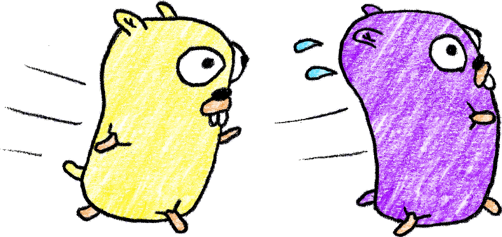
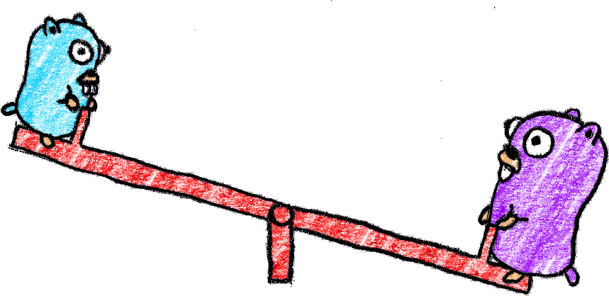

Notes:
olaaa

---

 <!-- .element: style="margin: 0; width: 250px;" -->

## Nicolas Lepage

Développeur chez Zenika Nantes

[ <!-- .element: style="margin: 0; vertical-align: middle; width: 60px;" --> @njblepage](https://twitter.com/njblepage)

[ <!-- .element: style="margin: 0 15px 0 0; vertical-align: middle; width: 35px;" --> github.com/nlepage](https://github.com/nlepage)

---

## Asynchronisme

Notes:
- Concurrence en Go et channels
- Asynchronisme en JS, promesses, async/await, event-loop
- Comprendre différences

---

## Des channels Go en JS

Notes:
Différentes manières d'implémenter
Implémenter fonctionnalités de base et avancées

---

## Exemple d'utilisation

---

## Disclaimer

Notes:
blabla

----

## Concurrence en Go

---

```go [|3,6|8-10|4|]
package main

func main() {
    go func1()
    // ...
}

func func1() {
    // ...
}
```

---

```go []
package main

import (
    "fmt"
    "time"
)

var solde = 100

func main() {
    go deposer(100)
    go deposer(200)

    time.Sleep(100*time.Millisecond)

    fmt.Println("Nouveau solde de", solde)
}

func deposer(montant int) {
    solde = solde + montant
}
```
<!-- .element: style="font-size: 0.38em;" -->

---


---


---

```go []
var solde = 100

func main() {
    var depots = make(chan int)

    go deposer(depots, 100)
    go deposer(depots, 200)

    for i:= 0; i < 2; i++ {
        var depot = <-depots
        solde = solde + depot
    }

    fmt.Println("Nouveau solde de", solde)
}

func deposer(depots chan int, montant int) {
    depots <- montant
}
```
<!-- .element: style="font-size: 0.33em;" -->

[ <!-- .element: style="margin: 0; width: 100px;" -->](https://play.golang.org/p/3ixH9HCi7lH) <!-- .element: target="_blank" -->

---

## Channels

## =

## Pas de mémoire partagée

----

## Asynchronisme en JS

---

```js []
function fetchUrl(url) {
    fetch(url).then((response) => {
        response.text().then((source) => {
            console.log(source)
        })
    })
}

fetchUrl('https://mdn.io/Promise')
```

---

```js []
async function fetchUrl(url) {
    const response = await fetch(url)
    const source = await response.text()
    console.log(source)
}

fetchUrl('https://mdn.io/async/await')
```

---

```js []
let solde = 100

async function main() {
    deposer(100)
    deposer(200)

    await new Promise(resolve => setTimeout(resolve, 100))

    console.log(solde)
}

async function deposer(montant) {
    solde = solde + montant
}
```

---

## Un seul Thread

---

## Event loop

<iframe width="560" height="315" src="https://www.youtube.com/embed/cgMADL39EGs" frameborder="0" allow="accelerometer; autoplay; clipboard-write; encrypted-media; gyroscope; picture-in-picture" allowfullscreen></iframe>

---

## "Run-to-completion"

---

```js []
function parseSource(source) {
    // ...
    const config = loadParserConfig()
    // ...
}

function parseUrl(url) {
    fetch(url).then((response) => {
        response.text().then(parseSource)
    })
}

parseUrl('https://mdn.io/Promise')
parseUrl('https://mdn.io/async/await')
```

---

```js []
async function parseSource(source) {
    // ...
    const config = loadParserConfig()
    // ...
}

async function parseUrl(url) {
    const response = await fetch('https://mdn.io/Promise')
    const source = await response.text()
    parseSource(source)
}

parseUrl('https://mdn.io/Promise')
parseUrl('https://mdn.io/async/await')
```

---

```js []
async function parseSource(source) {
    // ...
    const config = await loadParserConfig()
    // ...
}

async function parseUrl(url) {
    const response = await fetch('https://mdn.io/Promise')
    const source = await response.text()
    parseSource(source)
}

parseUrl('https://mdn.io/Promise')
parseUrl('https://mdn.io/async/await')
```

---

## "Run-to-completion"

## =

## Partage de mémoire sûr

---

```js []
let solde = 100

async function main() {
    deposer(100)
    deposer(200)

    await new Promise(resolve => setTimeout(resolve, 100))

    console.log(solde)
}

async function deposer(montant) {
    solde = solde + montant
}
```

----


## Inutiles donc indispensables !

----

## Comment ?

Notes:
- Quelle API ?

---

### async/await et Classes ES6

```js []
async function example() {
    const ch = new Chan()

    const v = await ch.recv()
    await ch.send(123)
}
```

---

### async/await et plain objects

```js []
async function example() {
    const ch = { /* état du channel */ }

    const v = await recv(ch)
    await send(ch, 123)
}
```

---

<!-- .slide: data-transition="convex-in none" -->

### async/await et références

```js []
async function example() {
    const ch = chan()

    const v = await recv(ch)
    await send(ch, 123)
}
```

---

<!-- .slide: data-transition="none convex-out" -->

### async/await et références

```js []
async function example() {
    const ch = chan()

    const p = recv(ch)
    await send(ch, 123)
}
```

---

### Fonctions génératrices et références

```js []
function* example() {
    const ch = chan()

    const v = yield recv(ch)
    yield send(ch, 123)
}
```

---

##  <!-- .element: style="margin: 0 25px 0; vertical-align: middle; width: 200px;" --> CuillereJS

Framework d'exécution de fonction génératrice.

Un ami 👉 [ <!-- .element: style="maring: 0; vertical-align: middle; width: 400px;" -->](https://github.com/EmrysMyrddin)

---

```js []
const cuillere = require('@cuillere/core')

function* helloWorld() {
    const name = yield getName()

    console.log(`Hello ${name}!`) // "Hello world!"
}

function* getName() {
    return 'world'
}

cuillere().start(example())
```

---

```js []
let solde = 100
 
function* main() {
    const depots = chan()
 
    yield fork(deposer(depots, 100))
    yield fork(deposer(depots, 200))
 
    for (let i = 0; i < 2; i++) {
        const depot = yield recv(depots)
        solde = solde + depot
        console.log(`Dépôt de ${depot} reçu`)
    }
 
    console.log(`Nouveau solde de ${solde}`)
}
 
function* deposer(depots, montant) {
    yield send(depots, montant)
    console.log(`Dépôt de ${montant} terminé`)
}
```
<!-- .element: style="font-size: 0.38em;" -->

---

```js []
const cllr = cuillere(channelsPlugin())

cllr.start(main())
```

---

[ <!-- .element: style="width: 400px;" -->](vscode://file/home/nico/git/cuillere-channels/live1.spec.js)

----

## C'est tout ?

---

 <!-- .slide: style="padding-left: 200px; text-align: left;" -->

### ☑ Envoi et réception
### ☐ Channel avec buffer
### ☐ Fermeture de channel
### ☐ Itération sur channel
### ☐ Select

---

## Channel avec buffer

---

## TODO schéma

---

```go []
var solde = 100

func main() {
    var depots = make(chan int, 5)

    var montants = []int{100, 200, 500, 1000, 600, 400, 300, 700, 900, 800}
    for _, montant := range montants {
        go deposer(depots, montant)
    }

    for range montants {
        var depot = <-depots
        solde = solde + depot
    }

    fmt.Printf("Nouveau solde de %d\n", solde)
}

func deposer(depots chan int, montant int) {
    depots <- montant
}
```
<!-- .element: style="font-size: 0.38em;" -->

[ <!-- .element: style="margin: 0; width: 100px;" -->](https://play.golang.org/p/qx6X_cXAiBq) <!-- .element: target="_blank" -->

---

```js []
let solde = 100
 
function* main() {
    const depots = chan(5)
 
    let montants = [100, 200, 500, 1000, 600, 400, 300, 700, 900, 800]
    for (const montant of montants) yield fork(deposer(depots, montant))
    
    for (let i = 0; i < montants.length; i++) {
        const depot = yield recv(depots)
        solde = solde + depot
        console.log(`Dépôt de ${depot} reçu`)
    }
 
    console.log(`Nouveau solde de ${solde}`)
}

function* deposer(depots, montant) {
    yield send(depots, montant)
    console.log(`Dépôt de ${montant} terminé`)
}
```
<!-- .element: style="font-size: 0.38em;" -->

---

[ <!-- .element: style="width: 400px;" -->](vscode://file/home/nico/git/cuillere-channels/live2.spec.js)

----

 <!-- .slide: style="padding-left: 200px; text-align: left;" -->

### ☑ Envoi et réception
### ☑ Channel avec buffer
### ☐ Fermeture de channel
### ☐ Itération sur channel
### ☐ Select

---

## Fermeture de channel

---

```go []
var solde = 100

func main() {
    var depots = make(chan int, 5)

    go deposer(depots, []int{100, 200, 500, 1000, 600, 400, 300, 700, 900, 800})

    for {
        var depot, ok = <-depots
        if !ok {
            break
        }
        solde = solde + depot
    }

    fmt.Printf("Nouveau solde de %d\n", solde)
}

func deposer(depots chan int, montants []int) {
    for _, montant := range montants {
        depots <- montant
    }
    close(depots)
}
```
<!-- .element: style="font-size: 0.33em;" -->

[ <!-- .element: style="margin: 0; width: 100px;" -->](https://play.golang.org/p/ksLbut42NCb) <!-- .element: target="_blank" -->

---

```js []
let solde = 100

function* main() {
    const depots = chan(5)

    yield fork(deposer(depots, [100, 200, 500, 1000, 600, 400, 300, 700, 900, 800]))

    while (true) {
        const [depot, ok] = yield recv(depots, true)
        if (!ok) break
        solde = solde + depot
        console.log(`Dépôt de ${depot} reçu`)
    }

    console.log(`Nouveau solde de ${solde}`)
}

function* deposer(depots, montants) {
    for (const montant of montants) {
        yield send(depots, montant)
    }
    close(depots)
}
```
<!-- .element: style="font-size: 0.34em;" -->

---

## Les règles

- On peut encore recevoir
- On ne peut plus envoyer
- On ne peut fermer qu'une seule fois

---

[ <!-- .element: style="width: 400px;" -->](vscode://file/home/nico/git/cuillere-channels/live3.spec.js)

Notes:

- chan: ajout closed
- close: implem sans drain (FIXME)
- detail:
  - recv factory
  - recv handler (x3)
  - send handler (appel recver)
- closed:
  - send handler
  - recv handler (avant Promise)
- close: drain recvQ

----

 <!-- .slide: style="padding-left: 200px; text-align: left;" -->

### ☑ Envoi et réception
### ☑ Channel avec buffer
### ☑ Fermeture de channel
### ☐ Itération sur channel
### ☐ Select

---

## Itération sur channel

---

```go []
var solde = 100

func main() {
    var depots = make(chan int, 5)

    go deposer(depots, []int{100, 200, 500, 1000, 600, 400, 300, 700, 900, 800})

    for depot := range depots {
        solde = solde + depot
    }

    fmt.Printf("Nouveau solde de %d\n", solde)
}

func deposer(depots chan int, montants []int) {
    for _, montant := range montants {
        depots <- montant
    }
    close(depots)
}
```
<!-- .element: style="font-size: 0.4em;" -->

[ <!-- .element: style="margin: 0; width: 100px;" -->](https://play.golang.org/p/xBXZ2b_vwMA) <!-- .element: target="_blank" -->

---

```js []
let solde = 100

function* main() {
    const depots = chan(5)

    yield fork(deposer(depots, [100, 200, 500, 1000, 600, 400, 300, 700, 900, 800]))

    for (let [depot, ok] = yield recv(depots, true); ok; [depot, ok] = yield recv(depots, true)) {
        solde = solde + depot
        console.log(`Dépôt de ${depot} reçu`)
    }

    console.log(`Nouveau solde de ${solde}`)
}

function* deposer(depots, montants) {
    for (const montant of montants) {
        yield send(depots, montant)
    }
    close(depots)
}
```
<!-- .element: style="font-size: 0.36em;" -->

---

### `for...of`

```js []
for (const valeur of itérable) {
    console.log(valeur)
}
```

Notes:

- Expliquer itérable

---

### ES2018 : `for await...of`

```js []
for await (const valeur of iterableAsynchrone) {
    console.log(valeur)
}
```

---

```js []
let solde = 100

function* main() {
    const depots = chan(5)

    yield fork(deposer(depots, [100, 200, 500, 1000, 600, 400, 300, 700, 900, 800]))

    for await (const depot of range(depots)) {
        solde = solde + depot
        console.log(`Dépôt de ${depot} reçu`)
    }

    console.log(`Nouveau solde de ${solde}`)
}

function* deposer(depots, montants) {
    for (const montant of montants) {
        yield send(depots, montant)
    }
    close(depots)
}
```
<!-- .element: style="font-size: 0.38em;" -->

---

[ <!-- .element: style="width: 400px;" -->](vscode://file/home/nico/git/cuillere-channels/live4.spec.js)

----

 <!-- .slide: style="padding-left: 200px; text-align: left;" -->

### ☑ Envoi et réception
### ☑ Channel avec buffer
### ☑ Fermeture de channel
### ☑ Itération sur channel
### ☐ Select

---

## Select

---

```go
func main() {
    var ch1 = make(chan int)
    var ch2 = make(chan string)

    select {
    case ch1 <- 123:
        fmt.Println("123 envoyé !")
    case ch2 <- "foo":
        fmt.Println("foo envoyé !")
    }
}
```

---

```go
func main() {
    var ch1 = make(chan int)
    var ch2 = make(chan string)

    select {
    case value := <-ch1:
        fmt.Println(value)
    case value := <-ch2:
        fmt.Println(value)
    }
}
```

---

```go
func main() {
    var ch = make(chan int)

    select {
    case ch <- 123:
        fmt.Println("123 envoyé !")
    default:
        fmt.Println("Envoi impossible !")
    }
}
```

---

```go
func main() {
    var ch = make(chan int)

    select {
    case ch <- 123:
        fmt.Println("123 envoyé !")
    case <-time.After(10*time.Second):
        fmt.Println("Timeout !")
    }
}
```
